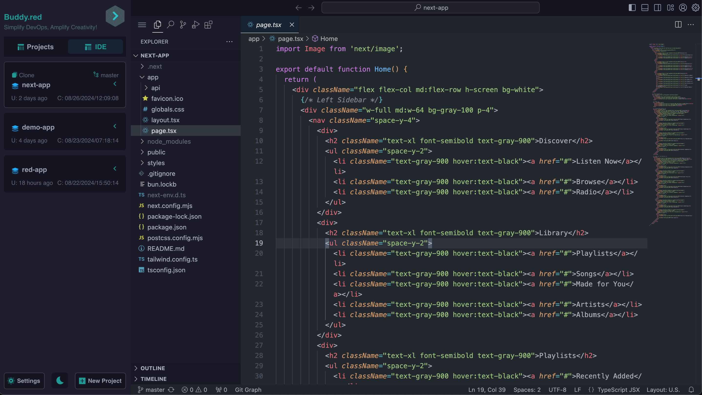
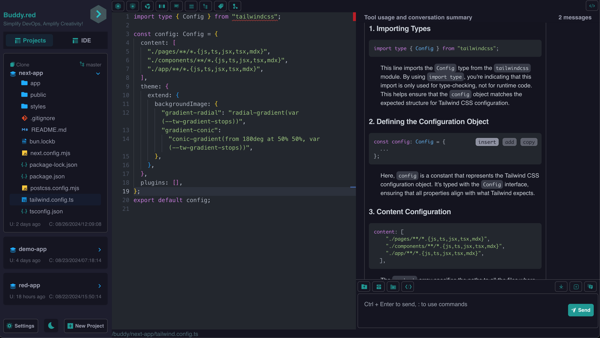
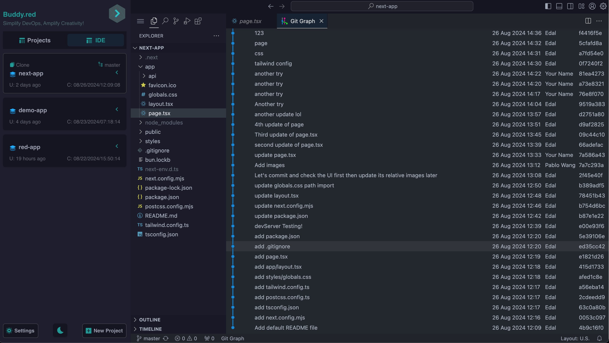

### **Leveraging LLMs with DevOps: Enhancing Your Development Environment with WebIDE Support**

The intersection of DevOps and artificial intelligence has revolutionized the way development environments are managed and optimized. One of the latest advancements in this domain is the integration of Large Language Models (LLMs) with DevOps practices, specifically through the use of WebIDEs (Web Integrated Development Environments). This combination not only streamlines workflows but also enhances productivity by making development environments highly responsive, intelligent, and available on demand. In this article, we’ll explore how LLMs can be integrated with DevOps to create a seamless development environment, the benefits of WebIDE support, and why this setup is superior to traditional approaches.

|  |
|-|

### **1. Understanding DevOps and the Role of LLMs**

#### **DevOps: Bridging the Gap Between Development and Operations**

DevOps is a set of practices that aims to shorten the development lifecycle and deliver high-quality software continuously. It fosters a collaborative environment between development and operations teams, using automation and monitoring throughout the application development lifecycle, from integration and testing to deployment and infrastructure management.

#### **Large Language Models: Beyond Automation**

LLMs, such as GPT-4, are AI models trained on vast datasets to understand and generate human-like text. In the context of DevOps, LLMs can be employed to automate code generation, debugging, documentation, and even decision-making processes. They add a layer of intelligence to the DevOps pipeline, helping to predict issues, optimize workflows, and provide contextual insights that are invaluable in fast-paced development environments.

|  |
|-|

### **2. The Emergence of WebIDEs: A New Paradigm in Development**

#### **What is a WebIDE?**

A WebIDE is an online code editor that provides a complete development environment accessible through a web browser. It allows developers to write, test, and deploy code without the need for local setups. WebIDEs like Code-Server(VS Code in the browser), Gitpod, CodeSandbox, and Visual Studio Code Spaces have gained popularity for their ease of use, configurability, and ability to provide consistent environments across different platforms.

#### **Advantages of WebIDEs in DevOps**

- **Consistency:** WebIDEs offer a standardized environment, which reduces the "works on my machine" problem by ensuring every developer works in the same setup.
- **Accessibility:** Since WebIDEs are accessible via a browser, developers can work from anywhere, using any device.
- **Scalability:** WebIDEs can scale resources up or down based on the needs of the project, optimizing performance and cost.
- **Integration:** WebIDEs seamlessly integrate with CI/CD pipelines, source control, and other DevOps tools, making them an ideal choice for modern development teams.

|  |
|-|

### **3. LLM-Driven WebIDEs: How They Work Together**

Integrating LLMs with WebIDEs can transform the development process by providing intelligent assistance and automating routine tasks. Here’s how this integration can work:

#### **Code Assistance and Generation**

LLMs can provide real-time code suggestions, auto-complete code, and generate boilerplate code based on the context. This can significantly speed up the coding process and reduce errors, especially for repetitive tasks or complex algorithms.

#### **Automated Debugging and Error Resolution**

Debugging is often one of the most time-consuming aspects of development. LLMs can analyze error messages, provide potential fixes, and even suggest changes to improve code quality. This reduces the time developers spend on debugging and allows them to focus on more creative aspects of coding.

#### **Enhanced Documentation and Knowledge Sharing**

LLMs can generate documentation from code comments and help maintain up-to-date documentation that evolves with the codebase. This ensures that all team members, regardless of when they join the project, have access to the latest information.

#### **Contextual Insights and Recommendations**

By analyzing the current code and development trends, LLMs can provide recommendations on best practices, potential security issues, and performance optimizations. This proactive approach helps in maintaining a high standard of code quality throughout the development lifecycle.

### **4. Why LLM-Integrated WebIDEs are Better: Key Benefits**

#### **1. **Increased Productivity**

By automating mundane tasks, LLMs free up developers to focus on more complex problem-solving and innovation. WebIDEs complement this by providing a streamlined, ready-to-use environment, minimizing setup and configuration times.

#### **2. **Cost Efficiency**

Traditional development environments often require significant infrastructure and maintenance costs. WebIDEs reduce these costs by leveraging cloud-based resources, which can be scaled according to demand. LLMs further optimize this by reducing the time required for code development and debugging.

#### **3. **Enhanced Collaboration**

With WebIDEs, teams can collaborate in real-time, sharing sessions, and making changes on the fly. LLMs can facilitate this by providing suggestions and solutions that can be discussed and implemented by the team, enhancing the collaborative aspect of DevOps.

#### **4. **Improved Learning Curve for New Developers**

New developers often face a steep learning curve when joining a project. LLMs can act as on-demand mentors, providing guidance, explaining code, and even teaching best practices. This accelerates the onboarding process and helps new team members become productive faster.

#### **5. **Scalability and Flexibility**

Both WebIDEs and LLMs are highly scalable. They can be tailored to the needs of the project, whether it’s a small startup or a large enterprise. This flexibility ensures that the development environment grows with the project, without requiring significant overhauls or investments.

### **5. Overcoming Challenges in LLM-Integrated DevOps**

While the integration of LLMs with DevOps and WebIDEs presents numerous benefits, there are challenges to consider:

#### **1. Data Security and Privacy**

Using LLMs often involves sending code and data to cloud-based models, which raises concerns about data security and privacy. Solutions include using on-premises models or ensuring that data is anonymized and protected through encryption.

#### **2. Model Accuracy and Reliability**

LLMs are not infallible; they can make mistakes, especially with complex or niche code. Continuous monitoring and validation of LLM outputs are necessary to ensure that the suggestions and code generated are accurate and reliable.

#### **3. Integration Complexity**

Integrating LLMs into existing DevOps workflows can be complex and may require custom development. Choosing the right tools and platforms that offer seamless integration capabilities is crucial to overcoming this hurdle.

#### **4. Performance Concerns**

The responsiveness of LLMs and WebIDEs can be impacted by network latency and resource availability. Ensuring that the infrastructure supporting these tools is robust and scalable is essential to maintaining optimal performance.

### **6. Case Studies and Real-World Applications**

#### **Case Study 1: Streamlining Development at a Large Enterprise**

A large enterprise integrated GPT-4 with their WebIDE environment to assist developers in generating boilerplate code for microservices. The LLM was trained on their specific codebase, allowing it to provide tailored suggestions. This integration reduced the average development time per microservice by 30%, significantly speeding up the company’s digital transformation efforts.

#### **Case Study 2: Enhancing Collaboration in a Distributed Team**

A startup with a fully remote team adopted a WebIDE with LLM support to enhance collaboration. Developers could share their coding sessions live, with the LLM offering real-time suggestions. This setup not only improved code quality but also fostered a collaborative culture where team members could learn from each other through the LLM’s insights.

### **7. Future Trends and Developments**

The combination of LLMs and WebIDEs is still in its early stages, but several trends point to a promising future:

#### **1. **Increased Customization and Personalization**

Future LLMs will offer more customization options, allowing developers to fine-tune the models according to their project’s specific needs. This will make LLMs even more valuable as personal coding assistants.

#### **2. **Deeper Integration with DevOps Pipelines**

We can expect even deeper integration of LLMs with DevOps pipelines, where models will not just assist in coding but also play a role in deployment, monitoring, and feedback loops, making the entire development process more intelligent and automated.

#### **3. **Expansion of WebIDE Capabilities**

WebIDEs will continue to evolve, incorporating more advanced features such as built-in AI analytics, voice-to-code capabilities, and more robust security features, making them indispensable tools in the developer's toolkit.

### **Conclusion**

The integration of LLMs with DevOps practices through WebIDEs represents a significant leap forward in how development environments are conceived and utilized. By enhancing automation, improving collaboration, and reducing costs, this setup provides a superior alternative to traditional development methods. As these technologies continue to evolve, their impact on software development will only grow, making LLM-integrated WebIDEs a key component of the modern DevOps toolkit. Whether you’re a startup looking to scale quickly or an enterprise seeking to optimize your development processes, embracing this technology could be the catalyst for your next big leap in productivity and innovation.
