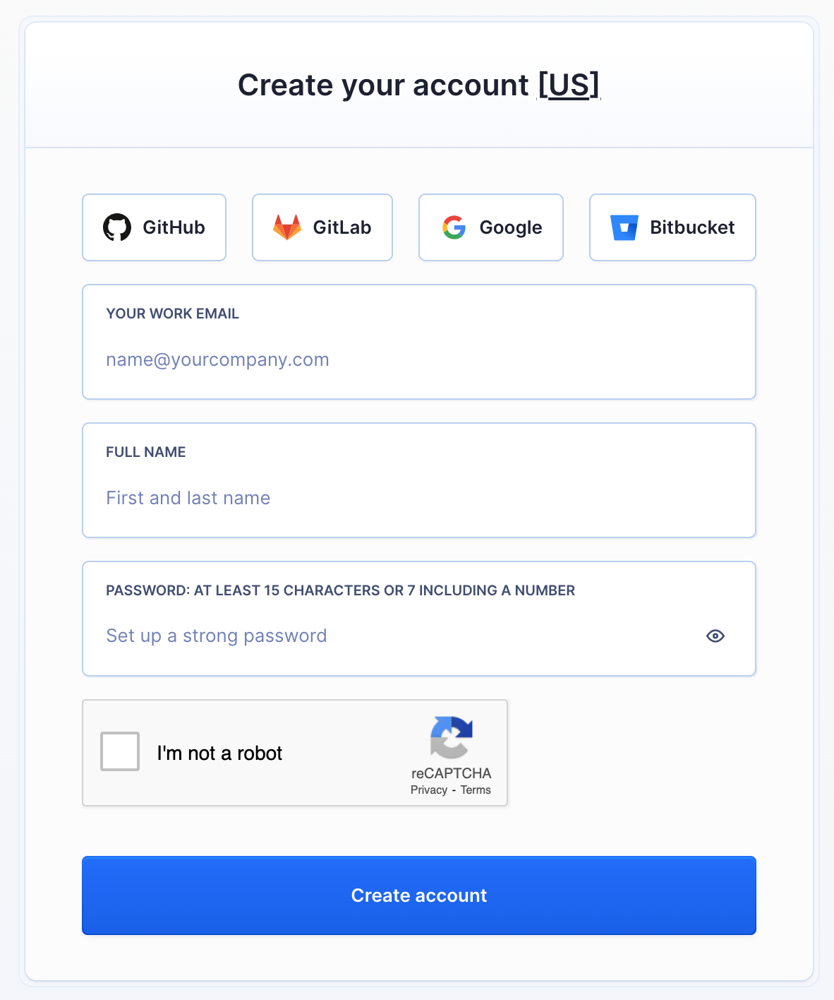
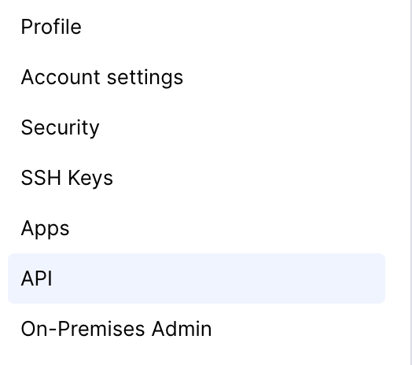
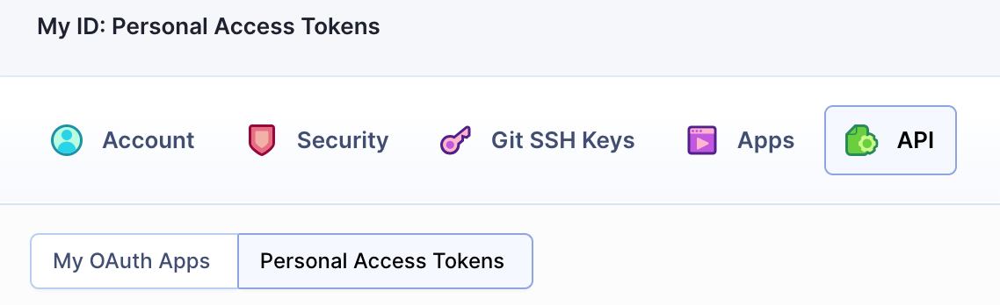
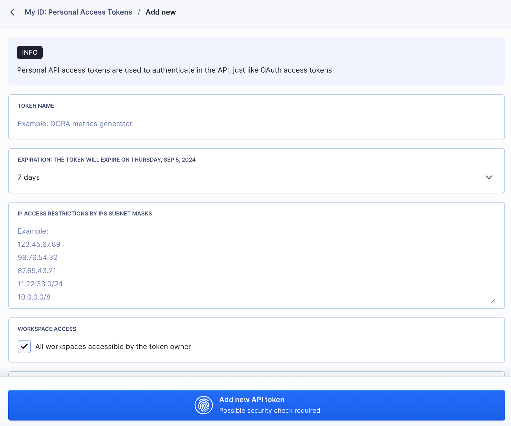
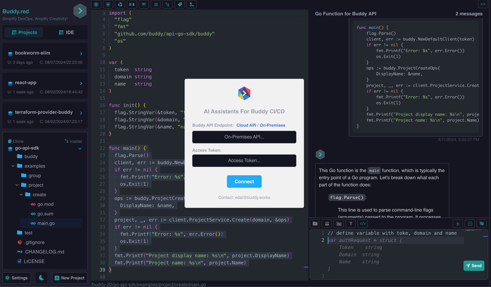

## Getting Started with Buddy.red: Three Approaches

To get started with Buddy.red, you only need two things: an API URL endpoint and an Access Token. Below are three ways to set up and use Buddy.red:

1. **Buddy.works Cloud Account Registration**
2. **Buddy On-Premises**
3. **Buddy & Buddy.red On-Premises (Enterprise) Installation & Configuration Services**

### 1. Buddy.works Cloud Account Registration

To use Buddy.red with a Buddy.works cloud account:

1. **Sign Up**: Create an account at [Buddy.works](https://buddy.works/sign-up).

|  |
|-|

2. **Generate a Personal Access Token**: After signing up, navigate to the API tab to generate your Personal Access Token.

|  |
|-|

|  |
|-|

|  |
|-|

#### API Endpoints

Depending on your account location, use one of the following API endpoints:

- **US Accounts**:  
  For accounts starting with `app.buddy.works`:
  ```bash
  https://api.buddy.works
  ```

- **EU Accounts**:  
  For accounts starting with `eu.buddy.works`:
  ```bash
  https://api.eu.buddy.works
  ```

### 2. Buddy On-Premises

For those using Buddy in an on-premises environment, the API endpoint will be determined by your server configuration:

- If using an IP address:
  ```bash
  https://YOUR-IP-ADDRESS/api
  ```
- If using a custom domain:
  ```bash
  https://YOUR-DOMAIN/api
  ```

Once you have your API endpoint and Access Token, go to [Buddy.red](https://buddy.red) to input these details and start connecting with Buddy.red.

|  |
|-|

### 3. Buddy & Buddy.red On-Premises (Enterprise) Installation & Configuration Services

For enterprise-level installations, we offer full installation and configuration services for both Buddy On-Premises and Buddy.red On-Premises, including OAuth authentication setup and integration.

To get started, simply **[contact us](https://id.buddy.red/authentication/login)**, and we will handle everything required to set up your Buddy & Buddy.red On-Premises environment.